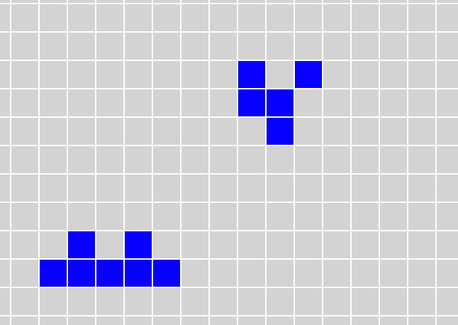

# Game of Life (Svelte version)

## Spiel des Lebens

1970 entwickelte der britische Mathematiker John Horton Conway ein einfaches Spiel, basierend auf einem zellulären Automaten, das bis heute noch fasziniert: Das 'Game Of Life'. Die Spielregeln sind ganz einfach: Die 'Welt' besteht aus Zellen, die entweder lebend oder unbelebt sein können. Wenn eine unbelebte Zelle genau zwei lebende Nachbarn hat, entsteht in ihr neues Leben. Wenn eine lebende Zelle weniger als zwei oder mehr als drei lebende Nachbarn hat, stirbt sie.

Basierend auf diesen einfachen Regeln können sich recht komplexe 'Lebensformen' entwickeln, wobei nur wenigen eine lange Existenz beschieden ist. 
Hier ein Beispiel für eine einfache Ausganskonfiguration, die zu einer Kollision der beiden Objekte führt, aus der eine sich über mehr als 1000 Generationen wachsende Population entwickelt:



Der Wikipedia Artikel (https://de.wikipedia.org/wiki/Conways_Spiel_des_Lebens) enthält viele weiterführende Informationen dazu. 
Dies hier ist eine simple eigene Version, erstellt als Fingerübung mit dem modernen Web-Framwework [Svelte](https://svelte.dev). Die Grösse der "Welt" kann in src/services/stores.ts verändert werden. Sie ist in sich geschlossen: Was an einer Seite hinauswandert, tritt an der Gegenüberliegenden wieder ein. 

Wenn einem eine besonders interessante Startkonfiguration geglückt ist, kann man "Speichern". Das speichert nicht den aktuellen Stand, sondern den Stand, wie er beim letzten "Start" war. Speicherort ist der lolale Anwendungsspeicher (localStorage) des Browsers.

Der Rest des Readme ist Originaldokumentation des Svelte templates.

---

# svelte-life

This is created from a project template for [Svelte](https://svelte.dev) apps. It lives at https://github.com/sveltejs/template.

To create a new project based on this template using [degit](https://github.com/Rich-Harris/degit):

```bash
npx degit sveltejs/template svelte-app
cd svelte-app
```

*Note that you will need to have [Node.js](https://nodejs.org) installed.*


## Get started

Install the dependencies...

```bash
cd svelte-life
npm install
```

...then start [Rollup](https://rollupjs.org):

```bash
npm run dev
```

Navigate to [localhost:5000](http://localhost:5000). You should see your app running. Edit a component file in `src`, save it, and reload the page to see your changes.

By default, the server will only respond to requests from localhost. To allow connections from other computers, edit the `sirv` commands in package.json to include the option `--host 0.0.0.0`.

If you're using [Visual Studio Code](https://code.visualstudio.com/) we recommend installing the official extension [Svelte for VS Code](https://marketplace.visualstudio.com/items?itemName=svelte.svelte-vscode). If you are using other editors you may need to install a plugin in order to get syntax highlighting and intellisense.

## Building and running in production mode

To create an optimised version of the app:

```bash
npm run build
```

You can run the newly built app with `npm run start`. This uses [sirv](https://github.com/lukeed/sirv), which is included in your package.json's `dependencies` so that the app will work when you deploy to platforms like [Heroku](https://heroku.com).


## Deploying to the web

### With [Vercel](https://vercel.com)

Install `vercel` if you haven't already:

```bash
npm install -g vercel
```

Then, from within your project folder:

```bash
cd public
vercel deploy --name my-project
```

### With [surge](https://surge.sh/)

Install `surge` if you haven't already:

```bash
npm install -g surge
```

Then, from within your project folder:

```bash
npm run build
surge public my-project.surge.sh
```
