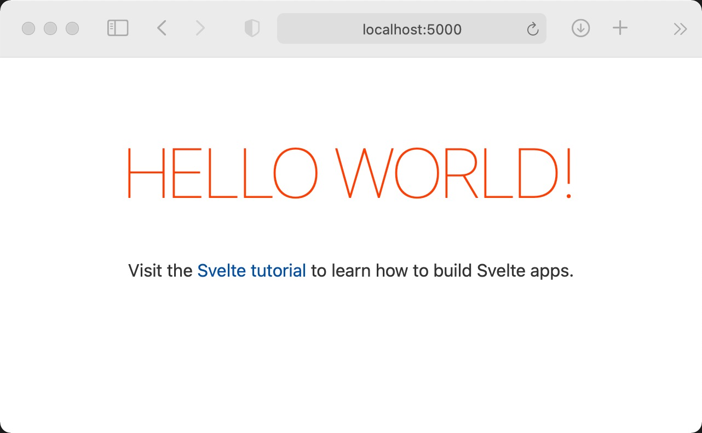

# Game of Life (Svelte version)

## Spiel des Lebens

1970 entwickelte der britische Mathematiker John Horton Conway ein einfaches Spiel, basierend auf einem zellulären Automaten, das bis heute noch fasziniert: Das 'Game Of Life'. Die Spielregeln sind ganz einfach: Das 'Universum' besteht aus Zellen, die entweder lebend oder unbelebt sein können. Wenn eine unbelebte Zelle genau zwei lebende Nachbarn hat, entsteht in ihr neues Leben. Wenn eine lebende Zelle weniger als zwei oder mehr als drei lebende Nachbarn hat, stirbt sie.

Basierend auf diesen einfachen Regeln können sich recht komplexe 'Lebensformen' entwickeln, wobei nur wenigen eine lange Existenz beschieden ist. Der Wikipedia Artikel (https://de.wikipedia.org/wiki/Conways_Spiel_des_Lebens) enthält viele weiterführende Informationen dazu. Hier wollen wir eine eigene Version, basierend auf dem modernen Web-Framework Svelte entwickeln.

## Voraussetzungen

Zum Bau und Start der Anwendung benötigen Sie NodeJS in Version 14 oder höher. Wie Sie NodeJS installieren können, entnehmen Sie bitte der Node-Website. Je nach Ihrem Betriebssystem müssen Sie npm separat installieren.


## Start

Zunächst laden wir das svelte-Template herunter und speichern es unter einem neien Namen -hier svelte-life- ab. Dann installieren wir dort die in package.json deklarierten Abhängigkeiten mittels `npm install` oder kurz `npm i` und starten dann die Entwicklunges Version mit `npm run dev`. Zusammen:


````
npx degit sveltejs/template svelte-life
cd svelte-life
npm i
npm run dev
`````

Richten Sie Ihren Browser auf [http://localhost:5000](), und schon werden Sie mit dem Svelte Startbildschirm belohnt:




Da wir lieber in Typescript programmieren möchten, konvertieren wir das Projekt. Stoppen <Sie das laufende Script mit STRG-C und geben Sie ein:

`````
node ./scripts/setupTypeScript.js 
npm i
`````

Das erneute `npm i` ist erforderlich, weil das Konvertieren weitere Abhängigkeiten deklariert hat. Wenn wir jetzt erneut `npm run dev` eingeben, sehen wir im Browser dasselbe, wie vorhin.

Lassen Sie den Browser geöffnet und das Script laufen, und öffnen Sie src/main.ts. Ändern Sie 

````
props: {
  name: 'world'
}
````

in 

````
props:{
  name: 'everybody'
}
````
Speichern Sie und bringen Sie den Browser in den Vordergrund. Wie Sie sehen, wird die Änderung nach einer kurzen Verzögerung umgesetzt, ohne dass Sie explizit neu kompilieren und starten müssen.

Damit sind wir nun gerüstet, um eigene Komponenten zu programmieren. 